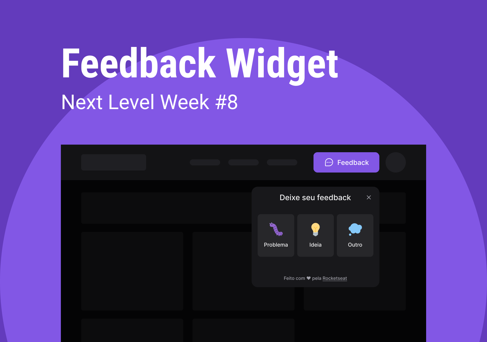

  

  <h2>Next Level Week #8</h2>
  <h2>ReactJS | React Native | NodeJS</h2>

  <a href="#about">📖 Sobre</a>&nbsp;&nbsp;&nbsp;|&nbsp;&nbsp;&nbsp;
  <a href="#design">🎨 Design</a>&nbsp;&nbsp;&nbsp;|&nbsp;&nbsp;&nbsp;
  <a href="#technologies">🔩 Tecnologias</a>

 

  

# 📖 Sobre o Projeto

O **Feedback Widget** é um componente que pode ser utilizado tanto em aplicações **Web** como em aplicações **Mobile**, com o intuito de coletar o feedback de seus usuários.

A versão web foi hospedada na [**Vercel**](https://vercel.com/), caso queira dar uma olhada, clique [**aqui**](https://feedback-widget-nlw-8.vercel.app/).

# 🎨 Design

O design do componente está disponivel no Figma, tanto na sua versão [**Web**](<https://www.figma.com/file/MQR24hkEUND513hz0yDDxU/Feedback-Widget-(Community)?node-id=10%3A1637>) como na sua versão [**Mobile**](<https://www.figma.com/file/MQR24hkEUND513hz0yDDxU/Feedback-Widget-(Community)?node-id=10%3A1638>).

# 🔩 Tecnologias

Estas foram as principais tecnologias utilizadas.

- [ReactJS](https://pt-br.reactjs.org/)
- [Vite](https://vitejs.dev/)
- [React Native](https://reactnative.dev/)
- [Expo](https://docs.expo.dev/)
- [NodeJS](https://nodejs.org/en/)
- [Express](https://expressjs.com/)
- [TypeScript](https://www.typescriptlang.org/)
